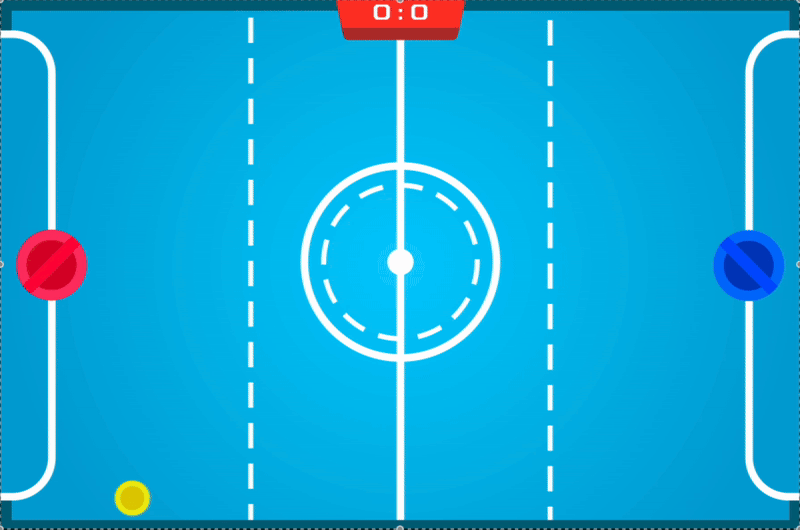

# Ping Pong Game 🎮
Ping Pong is a simple game that simulates the classic table tennis experience. Players control a paddle to hit the ball and score points when the ball passes their opponent's paddle. The game is developed for both learning and entertainment purposes.
## Features
- Paddle control using keyboard.
- Score points when the opponent misses the ball.
- Simple yet engaging graphical interface.
- Support for two-player.
## How to Play
1. **Start the Game**: Run the `main.py` file to begin.
2. **Paddle Control**:
   - The left player uses the `W` and `S` keys to move their paddle up and down.
   - The right player uses the up and down arrow keys to move their paddle.
3. **Scoring**: The ball will move between the two paddles. You need to control your paddle to hit the ball; if the ball passes your opponent's paddle, you score a point.
## Installation
1. Clone this repository to your local machine:
   ```bash
   git clone https://github.com/TruongPersonal/Ping_Pong.git
   ```
2. Install the required libraries:
    - if you are using Windows:
    ```bash
    pip install -r requirements.txt
    ```
    - if you are using MacOS or Linux:
    ```bash
    pip3 install -r requirements.txt
    ```
3.	Run the game:
    - if you are using Windows:
    ```bash
    python main.py
    ```
    - if you are using MacOS or Linux:
    ```bash
    python3 main.py
    ```

## Preview


## Notes
- Ensure that you have Python installed (version 3.12 or later) on your system before running the game.
- If you encounter any issues while installing `pygame`, make sure to check your Python and pip versions.
- Feel free to contribute to the project by reporting bugs or suggesting features!